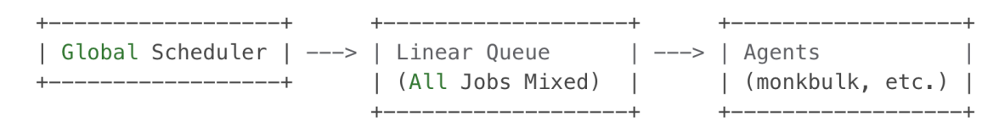

<!--
SPDX-License-Identifier: CC-BY-SA-4.0

SPDX-FileCopyrightText: 2024 Aditya Singh <email.here>
-->

## Author

[Aaditya Singh](https://github.com/Aaditya-Singh78)

## Contact info

- [Email](mailto:singh.aaditya889@gmail.com)
- [LinkedIn](https://www.linkedin.com/in/aadi-singh/)
- [Twitter](https://twitter.com/__Aadityasingh)

## OVERHAULING SCHEDULER DESIGN
The Fossology Scheduler, essential for managing tasks in the Fossology Application, is hindered by its outdated C programming, which lacks error handling and the ability to manage multiple tasks at once. The current design doesn't effectively manage job execution, especially for jobs that need to run independently for each upload but instead block other unrelated tasks. 

## What's the project about?

Insert Text Here

## What should be done?

What are the plans for the project?
