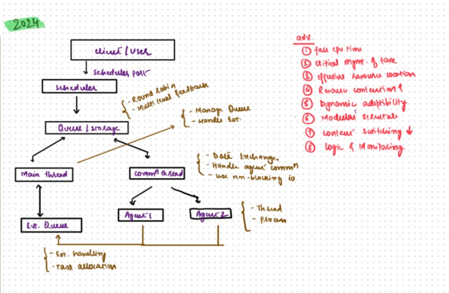
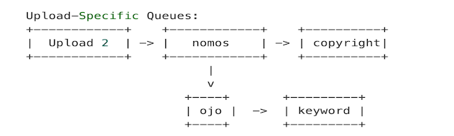

<!--
SPDX-License-Identifier: CC-BY-SA-4.0

SPDX-FileCopyrightText: 2024 Aditya Singh <singh.aaditya889@gmail.com>
--> 

# Meeting 2

*(May 31,2024)*

## Attendees:

  - [Anupam Ghosh](https://github.com/ag4ums)

  - [Shaheem Azmal M MD](https://github.com/shaheemazmalmmd)

  - [Gaurav Mishra](https://github.com/GMishx)

  - [Kaushlendra Pratap](https://github.com/Kaushl2208)

  - [Avinal](https://github.com/avinal)

  - [Aaditya Singh](https://github.com/Aaditya-Singh78)

## Discussion:

### Contributor

  - [Aaditya Singh](https://github.com/Aaditya-Singh78): Reading through the Job Scheduler [Documentation](https://github.com/fossology/fossology/wiki/Job-Scheduler) led to the frame current Scheduler. 
**Current Scheduler Design**
---

The Schematic frame out of Documentation illustrates about architectural overview of Job Scheduler.

*Architectural Overview:*

It is based on Client-Server model, where: 

1. **Scheduler Port:** It serves as the communication hub for clients and the scheduler.
2. **Main Thread:** It is responsible for job queuing, job allocation, and event management.
3. **Worker Threads:** They are implemented to handle specific tasks asynchronously, increasing throughput and reducing response times.

*Key Components:*

1. **Scheduler:** Coordinates all job scheduling operations and serves as the entry point for job requests.
2. **Asynchronous Workers:** Handle tasks in parallel, significantly improving processing time.
3. **Logging and Monitoring:** Integrated logging system for real-time monitoring and troubleshooting.

### Does the Current Scheduler Design align with Job Scheduler [Documentation](https://github.com/fossology/fossology/wiki/Job-Scheduler)?

#### Mentor
- [Gaurav Mishra](https://github.com/GMishx): Yes, it aligns with current architecture of job scheduler.

**New Scheduler Design**
---

The revised schematic of Job Scheduler design focuses on an efficient multithreaded approach.that illustrates architectural overview of Job Scheduler.

*Architectural Overiew:*

1. **Main Thread:** Coordinates with various components of the scheduler and ensures that tasks are handed over to the appropriate threads for execution.

2. **Worker Thread:** Handles interactions between different agents (or services) that are part of the scheduler. This thread ensures that all components are synchronized and operate without conflicts.

3. **Event Queue:** Handles all system-level events and ensures proper event handling and error logging.

*Key Components:*

1. **Scheduler:** Acts as the central command that receives tasks from the client. It uses a round-robin technique for managing tasks, ensuring a fair and efficient distribution of CPU time among tasks.

2. **Queue Storage:** This component is responsible for holding the tasks before they are processed. It operates under the FIFO (First In, First Out) principle but is managed dynamically to adapt to varying workload conditions.

> ⚠️ **Disclaimer**: Discovered discrepancies through post-meeting analysis.

**Trade-off**
---

|*Old Job Scheduler* |*New Job Scheduler* |
|--------------------|--------------------|
Easier to Maintain   | Difficult to Maintain |
Centralised Monitoring | De-Centralised Monitoring |
Static resource management | Dynamic resource management |

### What are the benefits of New Scheduler Design? Will it be Effective?

#### Mentor
 - [Gaurav Mishra](https://github.com/GMishx): 
Given the complexity of the project's tasks, a simple time-based Round-robin setup might not be enough. A finite state machine architecture would likely be more suitable as it facilitates easier tracking and management of the project. This approach is worth considering.

 - [Anupam Ghosh](https://github.com/ag4ums): What specific requirements or functionalities are you looking to address with the job scheduler?
 

 - [Gaurav Mishra](https://github.com/GMishx): A significant issue that could be opened as project idea for a scheduler project concern involves no support nuanced control over job execution, specifically for jobs that should run **mutually exclusive** per upload but end up blocking other unrelated tasks. This flaw can cause inefficiencies in job processing and **resource allocation**.

    **Introduced idea of Utilising Bucket**
   
   The approach I've suggested of creating dedicated queues or "buckets" for each upload, where each one manages its priority tasks effectively. This structure enables precise task management like "nomos" or "copyright" for specific uploads. There is also a plan for a universal queue that handles tasks not linked to any specific upload, such as routine maintenance, ensuring these operations are executed without disrupting the individual upload processes.

    

##### Reference:

> ⚠️ **Disclaimer:** Learned additional details about wfx after the meeting.

  ###### **[WFX](https://github.com/siemens/wfx)**: 
  Worflow Executor by [Siemens](https://github.com/siemens/) is a versatile, lightweight workflow executor optimized for managing jobs as part of a workflow system. It is designed around a model where workflows are treated as finite-state machines, and it can dynamically manage and progress these workflows in coordination with client systems. Here are the 
  
  Key features relevant to a scheduler system:

  1. State Management: wfx manages workflows as state machines, ensuring that each job progresses through its defined states efficiently.

  2. Modularity: Its core is designed to be compact yet scalable, allowing it to handle diverse workflows without becoming cumbersome.

  3. Cross-Platform Efficiency: Developed in Go, wfx offers high performance and is compatible with multiple operating systems, making it suitable for various deployment environments.

  4. Dynamic Configuration: Workflows can be loaded or unloaded at runtime, supporting dynamic changes to the scheduler without downtime.

  5. Persistence Support: Includes built-in support for databases like SQLite, PostgreSQL, and MySQL, which is crucial for maintaining the state and history of workflows over time.
  
### How to Start Working on FOSSology Issue [#2742](https://github.com/fossology/fossology/issues/2742): Incorrect MIME Type Recognition for Text Files?

The issue [#2742](https://github.com/fossology/fossology/issues/2742) in the FOSSology project addresses a problem with incorrect MIME type recognition for text files. The issue is centered around the system's handling of MIME types, which are not being accurately recognized or applied, potentially affecting file handling and operations within FOSSology.

#### Mentor
 - [Shaheem Azmal M MD](https://github.com/shaheemazmalmmd): Found error, as user have  selected the option to "Ignore SCM files (Git, SVN, TFS) and files with particular Mimetype," which causes these files to be omitted accordingly. Conversely, this functionality will be inactive if the "Ignore SCM files (Git, SVN, TFS) and files with particular Mimetype" option is not enabled.

### [Wfx](https://github.com/siemens/wfx) Project Approach

#### Mentor

  - [Kaushlendra Pratap](https://github.com/Kaushl2208): Expressed interest in holding an internal discussion about the [wfx](https://github.com/siemens/wfx) project approach.

### Mentor
 - [Anupam Ghosh](https://github.com/ag4ums):
 Could you share what key achievements you expect to reach this week?

### Contributor

 - [Aaditya Singh](https://github.com/Aaditya-Singh78): Milestone to Achieve within this week are:
 1. Re-write code from written c programming language to Go Programming Language.
 2. Queue Implementation in Golang.