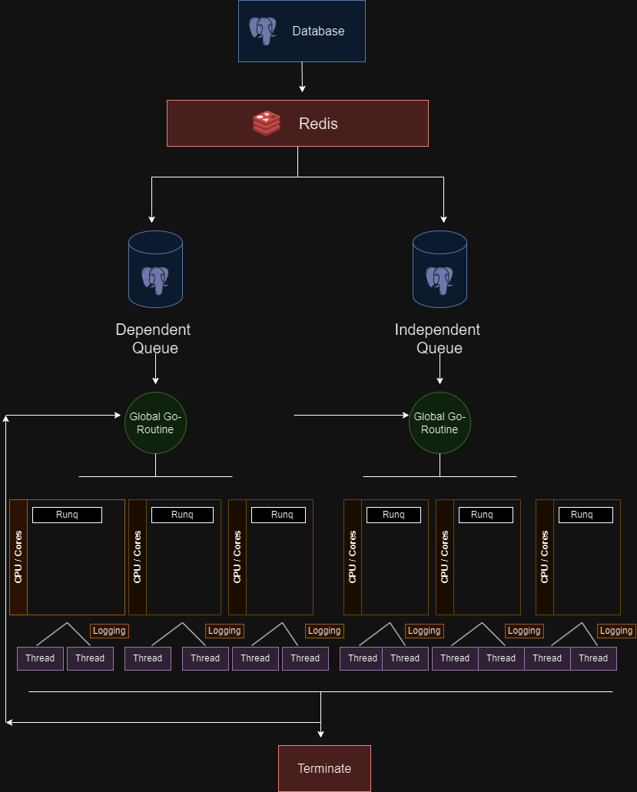

<!--
SPDX-License-Identifier: CC-BY-SA-4.0

SPDX-FileCopyrightText: 2024 Aditya Singh <singh.aaditya889@gmail.com>
--> 

# Meeting 4

*(June 07, 2024)*

## Attendees:

  - [Katharina Ettinger](https://github.com/EttingerK)

  - [Shaheem Azmal M MD](https://github.com/shaheemazmalmmd)

  - [Gaurav Mishra](https://github.com/GMishx)

  - [Kaushlendra Pratap](https://github.com/Kaushl2208)

  - [Avinal](https://github.com/avinal)

  - [Aaditya Singh](https://github.com/Aaditya-Singh78)

## Discussion:

### Contributor:

- [Aaditya Singh](https://github.com/Aaditya-Singh78): I've arrive with new approach of multi-level feedback system interacts with a database and uses Redis as a data store or caching layer. Below that, there are two distinct task queues: a Dependent Queue and an Independent Queue. Both queues are managed by global Go routines, suggesting the use of Go programming language for handling concurrency.

  Each queue distributes tasks to a set of CPU cores, each represented by a block labeled "RunQ," which is Go’s local run queue that holds runnable goroutines. Each CPU core further manages multiple threads, illustrating a multi-threaded processing model. The architecture suggests a design where tasks from the Dependent Queue and the Independent Queue are processed in parallel across multiple threads and cores, enhancing throughput and efficiency. At the bottom of the diagram, there's a "Terminate" process, indicating a mechanism to terminate the operations or handle cleanup.

  

#### Trade-off between old & new architecture

  | **Feature**               | **Multi-level Feedback Queue Scheduling System**                                                                 | **Client-Server Scheduling System**                                             |
  |---------------------------|---------------------------------------------------------------------------------------------------------|---------------------------------------------------------------------------------|
  | **Concurrency**           | High concurrency with efficient handling using Go's goroutines.                                         | Moderate concurrency managed through worker threads with centralized control.   |
  | **Complexity**            | Higher complexity due to synchronization needs and multiple queues management.                          | Lower complexity with a clearer separation of roles and modular components.     |
  | **Scalability**           | High scalability both horizontally (across servers) and vertically (more resources).                    | Scalable within server limits; may require additional servers for significant expansion. |
  | **Fault Tolerance**       | Decentralized task handling increases resilience against single component failures.                     | Centralized scheduler poses a risk of being a single point of failure.          |
  | **Resource Efficiency**   | Maximizes hardware utilization with multi-threaded, multi-core processing.                              | Efficient within the capacity of the server; potential bottlenecks at the scheduler. |
  | **Performance**           | Potentially higher performance under load due to distributed processing.                                | Performance may degrade under high loads if the central server becomes a bottleneck. |
  | **System Overhead**       | Logging and task management may introduce significant overhead, particularly with synchronization.      | Relatively lower overhead but depends on the efficiency of the central scheduler. |
  | **Manageability**         | More challenging to manage due to the inherent complexity of concurrency controls.                      | Easier to manage due to modularity and clear delineation of components.          |
  | **Adaptability**          | Can dynamically adjust to changes in workload by redistributing tasks among queues and threads.         | Adaptability through resource reallocation and worker thread adjustments based on demand. |
  | **Logging & Monitoring**  | Comprehensive logging at thread level provides detailed insights but adds to complexity.                | Centralized logging and monitoring may be simpler to implement and manage.       |

### Mentor:

-  [Shaheem Azmal M MD](https://github.com/shaheemazmalmmd): Can priority be implemented in both dependent and independent queues?

-  [Gaurav Mishra](https://github.com/GMishx): There are several considerations to take into account, such as:

1. Fossology aims to ensure mutual exclusivity either across dependent queues, independent queues, or both.

2. Each job instance requires execution one at a time, adhering to the rule of processing 60 requests per time frame, and there is a lack of a distributed database system.

How would you try to achieve with this architecture?

-  [Kaushlendra Pratap](https://github.com/Kaushl2208): How can goroutines achieve both concurrency and parallelism, whether synchronously or asynchronously?

### Setting Priority in Distributed Queue:
- [Aaditya Singh](https://github.com/Aaditya-Singh78): Yes, It can be constructed through refactoring of code.we can either pull `job_prioirty` from database or we can set custom priority.

### Mutual Exclusivity across Distributed Queue:
> ⚠️ **Disclaimer:** 
This issue was highlighted during the meeting, and after further research, I have come up with a solution.

- [Aaditya Singh](https://github.com/Aaditya-Singh78): To achive mutual exclusivity we would apply a process flow involving: 

1. Lock Acquisition:

    Attempt to Acquire a Lock: Before a Go routine processes a task from the distributed queue, it attempts to acquire a lock by setting a unique key in Redis (e.g., the job ID as the key). The SET command is used with `NX` and `PX` options:

    - `NX` ensures the key is set only if it does not already exist (lock not already held).

    - `PX` sets an expiration time for the key, ensuring that the lock is not held indefinitely (this helps in situations where the process might crash or hang, preventing a deadlock).

    Check Lock Status: If the SET command succeeds, the Go routine has successfully acquired the lock and can proceed. If it fails (the key already exists), it means another instance is processing the job, and this instance should either wait or move on to another task.

2. Job Processing:

    Once the lock is acquired, the Go routine processes the job. During this processing, no other instance can pick up or interfere with the same job due to the lock.

3. Lock Release:

    After the job is completed, the lock (key in Redis) should be released by deleting it. This is typically done using the DEL command. This step is crucial to ensure that other instances can now pick up new jobs without interference.

- [Aaditya Singh](https://github.com/Aaditya-Singh78):

### Connecting Distributed Scheduler with Centralised Database:

> ⚠️ **Disclaimer:** 
This issue was highlighted during the meeting, and after further research, I have come up with a solution.

[Aaditya Singh](https://github.com/Aaditya-Singh78): I'm considering utilizing Redis as middleware between a distributed scheduler and a centralized database by integrating it with a Multi-Level Feedback Queue (MLFQ) based distributed scheduler. This approach offers a substantial enhancement in managing complex task scheduling and system performance, particularly in comparison to the limitations of CronJobs in a Kubernetes setting due to:

1. **Concurrency Control with Redis**: Redis employs mechanisms such as SETNX or the `RedLock algorithm`, which are essential for ensuring that only one instance of any job runs across the distributed system. This is critical for preserving the integrity of job executions within your scheduler.
2. **Advanced Caching & State Management**: Redis effectively caches frequently accessed data, like job statuses and metadata. This minimizes direct database interactions, aids in maintaining `rate limits`, and enhances the response times for job status queries. Additionally, Redis serves as a central hub for state sharing among distributed nodes, facilitating rapid synchronization of job states without continuous database queries, which is vital for maintaining a responsive scheduler.
3. **Job Queue Management**: Leveraging Redis' `pub/sub` capabilities enables efficient job queue management across multiple scheduler instances, ensuring that jobs are evenly distributed and managed throughout your system.

However, there are several reasons for setting aside CronJobs:

1. **Static Time-Based Scheduling**: `CronJobs` are designed for tasks that need to run at predetermined times, lacking the necessary flexibility for jobs where priority and resource requirements may vary based on real-time data or user demands.
2. **Non-Dynamic Resource Management**: CronJobs do not adjust or prioritize tasks based on the current system load or task urgency, rendering them unsuitable for environments that demand resource adaptability.

### Concurrency & Parallelism:
#### Concurrency
It means, structuring a program to handle multiple tasks at once.

#### Parallelism
It refers to the simultaneous execution of multiple computations.

It can be achieved through Go.when concurrent processes run on multiple CPU cores.

- [Aaditya Singh](https://github.com/Aaditya-Singh78): Through present architecture proposed, we can achieve both as following:

1. **Achieving Concurrency**:

  - *Global Go-Routines*: Each queue (Dependent and Independent) is managed by a global Go-routine. This setup allows multiple tasks to be handled concurrently, as each global Go-routine can manage its tasks independently from others.

  - *Task Distribution*: Tasks from each queue are likely picked up by separate Go routines, enabling the `concurrent processing` of multiple tasks. This is crucial for tasks that are I/O bound or have waiting periods, allowing the system to make progress on other tasks during these idle times.

  - *Non-Blocking I/O and Asynchronous Operations*: By leveraging Go's built-in support for `non-blocking I/O` and  `asynchronous operations`, each Go-routine can perform tasks without waiting for other operations to complete, thereby improving the efficiency and responsiveness of the system.

2. **Achieving Parallelism**:

  - *CPU Cores and Threads*: The architecture diagram shows multiple CPU cores, each potentially running one or more threads. Each core can execute a separate Go-routine (or multiple Go-routines) in parallel, provided there are enough cores available.

  - *Logging Threads*: Each core has multiple threads dedicated to logging, which suggests that logging operations are handled in parallel with the main task processing. This setup helps in offloading the `I/O operations` associated with logging from the main computation threads, potentially increasing the overall `throughput`.

### Essential Impact on System Metrics:

#### Advantages: 

1. Enhanced Resource Optimization
2. Increased Throughput
3. Detailed Logging Framework
4. Improved System Performance
5. Resolving Bottlenecks
6. Ensuring Mutual Exclusivity
7. Facilitating Concurrent and Parallel Operations

#### Limitations:
1. Greater Complexity
2. Challenges with Integration Overhead
3. High Resource Demand 
 
### Beneficial Capability:
1. Finite State Machine (like version control system).

