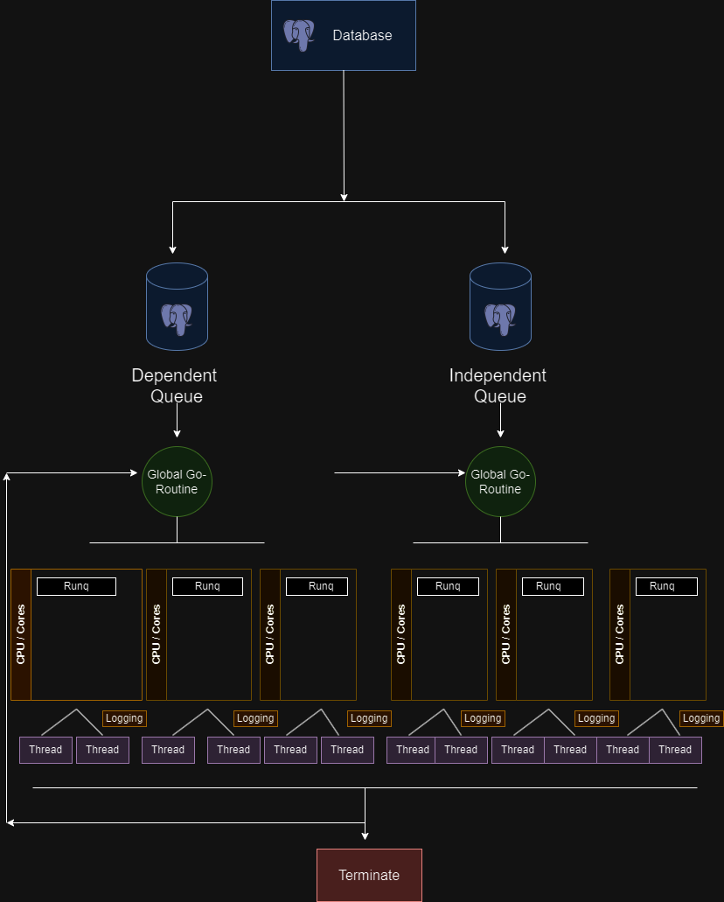

<!--
SPDX-License-Identifier: CC-BY-SA-4.0
SPDX-FileCopyrightText: 2024 Aaditya Singh <singh.aaditya889@gmail.com>
-->

# Meeting 8

*(June 07, 2024)*

## Attendees

- [Katharina Ettinger](https://github.com/EttingerK)
- [Shaheem Azmal M MD](https://github.com/shaheemazmalmmd)
- [Gaurav Mishra](https://github.com/GMishx)
- [Kaushlendra Pratap](https://github.com/Kaushl2208)
- [Avinal](https://github.com/avinal)
- [Aaditya Singh](https://github.com/Aaditya-Singh78)

## Discussion

**Contributors**:

- [Aaditya Singh](https://github.com/Aaditya-Singh78): Discussing integration and implementation strategies for the new scheduler design.

It consists of a sophisticated job scheduling system that leverages Go's powerful concurrency features to efficiently manage tasks across two *primary queues*:

1. Dependent Queue
2. Independent Queue 

Each queue is managed by a dedicated Global Go-Routine, which orchestrates the distribution and execution of tasks among multiple subordinate Go-Routines. These Go-Routines operate in parallel, each managing its own set of threads to ensure tasks are executed concurrently, *maximising throughput* & *minimising response time*. 

**Key Components:**

- *Database*: Central storage for all job-related data, ensuring durability and consistency across job executions.

- *Dependent Queue*: Manages jobs that depend on the completion of other jobs, ensuring correct execution order.

- *Independent Queue*: Handles jobs that can be executed independently, allowing for simultaneous processing and improved efficiency.

- *Logging*: Each thread incorporates logging to track job execution, facilitating debugging and system monitoring.

- *Termination*: Ensures all tasks are either completed or properly terminated before system shutdown, maintaining system integrity.

**Mentors**:

- [Shaheem Azmal M MD](https://github.com/shaheemazmalmmd): Questioned whether priority can be implemented in both dependent and independent queues effectively.

- [Gaurav Mishra](https://github.com/GMishx): Highlighted considerations for ensuring mutual exclusivity either across dependent or independent queues, with a focus on execution rules and limitations.

- [Kaushlendra Pratap](https://github.com/Kaushl2208): Inquired about how goroutines can achieve both concurrency and parallelism, and whether they should operate synchronously or asynchronously.