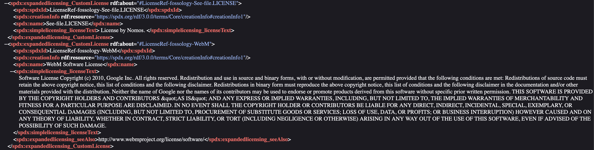
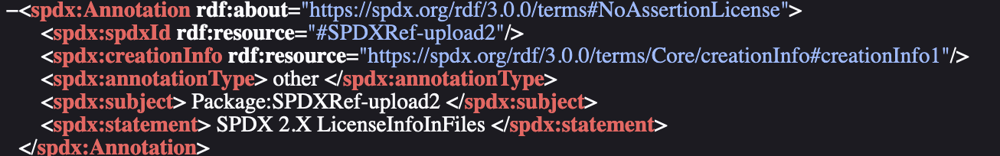

<!--
SPDX-License-Identifier: CC-BY-SA-4.0
SPDX-FileCopyrightText: 2024 Abhishek Kumar <akumar17871@gmail.com>
-->

# Week 7 meeting and activities

_(July 09,2024)_

## Attendees

* [Abhishek Kumar](https://github.com/abhi-kumar17871)
* [Gaurav Mishra](https://github.com/GMishx)
* [Shaheem Azmal M MD](https://github.com/shaheemazmalmmd)
* [Dearsh Oberoi](https://github.com/deo002)
* [Akash Sah](https://github.com/Akashsah2003)

## Discussion

* Updated on the Licensing Profile fields that were required for generation of the reports.
* Modified all the reports accordingly with the required fields.
* Got feedback from mentors to integrate the codebases of both the SPDX report i.e., v2.3 and v3.0 .
* Next Step: Will be working on the report-import of SPDX v3.0 RDF report and on integration as well.

## Activities

* Worked on the JSON-ld, JSON, RDF and tag: value reports for the Licensing Profile fields which were required.

## Sample Implementation of Licensing Profile

Implemented the following use cases as required by the organization under Licensing profile:
* ### Simple Licensing Any License Info: For all licenses

* ### Expanded Licensing Custom License: For Extracted License Info From File

* ### Expanded Licensing Conjunctive and Disjunctive Licensing Set: For Dual Licenses

* ### Annotation: For LicenseInfoFromFile and for LicenseInfoInFile

