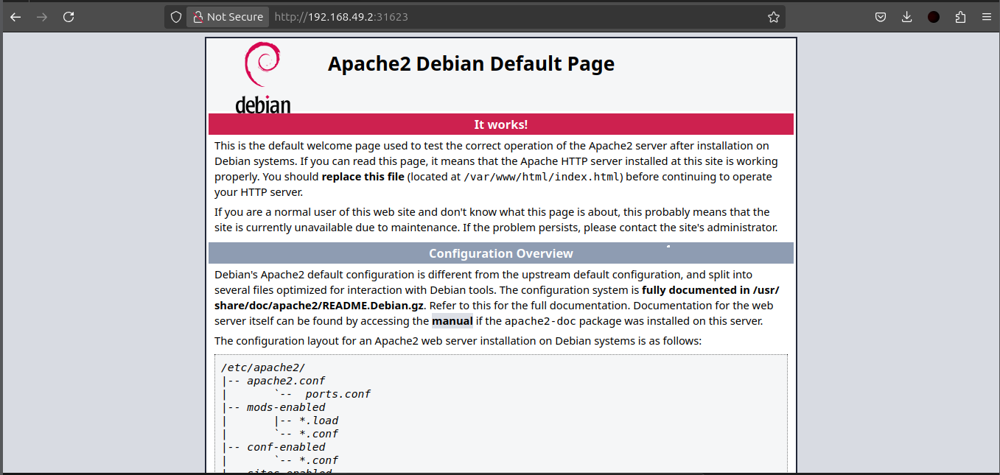
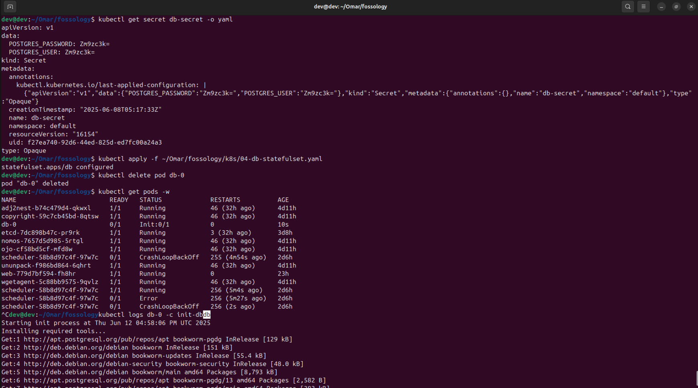
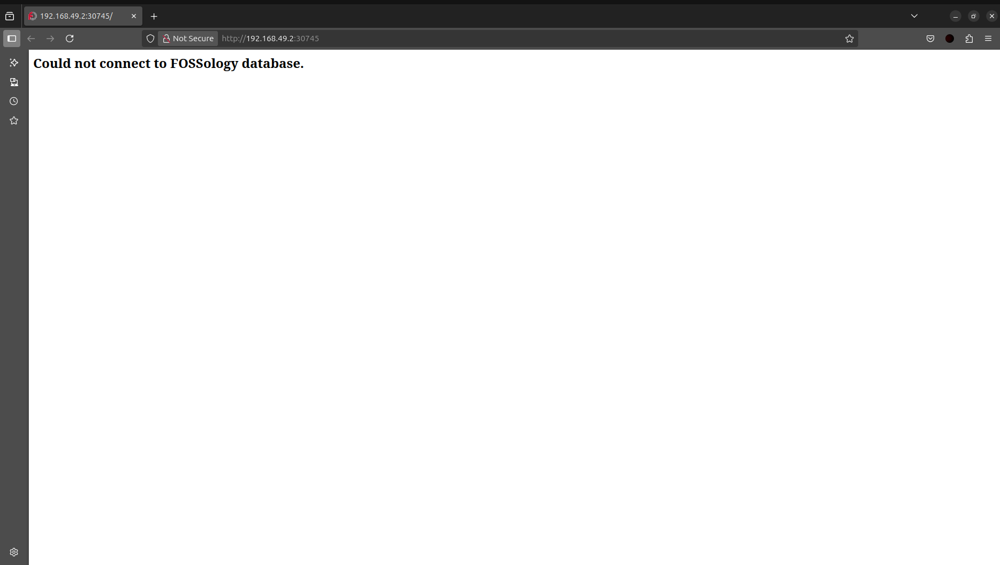

<!--
SPDX-License-Identifier: CC-BY-SA-4.0

SPDX-FileCopyright Text: 2025 Muhammad Salman <chsalmanramzan422@gmail.com>
-->

# Week 2

*(June 10, 2025 - June 16, 2025)*

## Continued Troubleshooting and Progress

This week, I focused heavily on solving the issues from Week 1 and making solid progress in setting up the FOSSology microservices using Docker, Minikube and Kubernetes. It was a challenging week, filled with lots of debugging, learning and small victories that kept me motivated.

## Switching to bookworm-slim Base Image

Following [Shaheem](https://github.com/shaheemazmalmmd)'s suggestion, I tried replacing the base image from <code>buster-slim</code> to <code> bookworm-slim </code>. I updated relevant dockerfiles like **Dockerfile.pkg** and started rebuilding everything.

Unfortunately, this caused multiple compatibility issues. The builds were failing due to some outdated dependencies not working well with <code>Bookworm</code>. After spending a lot of time debugging, I rolled back to <code>buster-slim </code> to keep things stable and moving.

## Fixing Docker Build Issues

Some <code>.deb</code> files were missing, which broke the build process.

I updated the <code>debian/changelog</code> and adjusted the **Dockerfile.pkg** build context.

I also handled merge conflicts while rebasing Omar’s changes, mainly in **04-db-statefulset.yaml**.

## Fixed the Web UI Issue

At first, the web UI was showing the default Debian Apache2 page instead of the FOSSology interface. Here how it looks:

After digging through the Dockerfile, I found some path issues. I fixed the file paths and rebuilt the image. After that, the correct FOSSology interface started showing up.

## All Docker Images Built & Tested Successfully

I was able to build and test all the following Base images:

- <code>**packages**</code>

- <code>**scheduler**</code>

- <code>**web**</code>

- <code>**ununpack**</code>

- <code>**wget_agent**</code>

- <code>**nomos**</code>

- <code>**copyright**</code>

- <code>**ojo**</code>

I loaded them into Minikube and run :  <code>kubectl apply -f k8s/</code>

I tested each container individually using <code> kubectl get pods </code> and manual validation, except **web** and **db** pods, everything worked smoothly.

Then I run: <code>minikube service web</code> and this time the UI opened in the default browser showing Database connection issue.

## Database Connection Issue

Even though everything else is working fine, I still couldn’t get the FOSSology UI to connect to the database. Here’s what’s happening:

    The <code>db-0</code> pod is stucked in <code>Init:0/1</code>.

    Visiting http://192.168.49.2:30745/ shows the **FOSSology Logo** displayed in browser tab but also showing:

    **"Could not connect to Fossology database"**

## Meeting 2

*(June 11, 2025)*

My mentor [Avinal](https://github.com/avinal) was out of the country and unavailable, so no meeting took place.

## Meeting 2

*(June 12, 2025)*

I joined the weekly community meeting. I shared my progress like fixing the web UI (Debian homescreen issue) and building all Docker images, but I also laid out the database connection issue that’s been a thorn in my side. They suggested the **PostgreSQL** problem might be a startup or installation and recommended trying <code>/etc/init.d/postgres start</code>, which later didn’t work in the pod environment.

## Meeting 3

*(June 14, 2025)*

I had a very helpful 1-on-1 call with [Shaheem](https://github.com/shaheemazmalmmd), where we tried to troubleshoot the database issue together.

Here’s what we tried:-

**Running PostgreSQL locally:** <code>psql -h localhost -p 5432 -U fossy</code>

This worked perfectly. The PostgreSQL server was running and responding locally via the command line.

**Confirmed DB Connection:**
From inside the container environment, PostgreSQL was also running and showing as connected.

**Still Broken on Browser URL:**
Despite local success, the URL http://192.168.49.2:30745/ still gave the database connection error.

**Pods & Build Issues:**
We realized that while the DB works locally, it fails inside **Kubernetes pods** due to something in the init container or service configuration. This was likely related to the startup order or network setup.

## What I Tried to Fix the DB Issue

I tried multiple fixes on my own to solve this:

    - Recreated the PersistentVolumeClaim (PVC) for the database

    - Updated **00-configmap.yaml** and **01-db-secret.yaml** with proper values

    - Added a readiness probe:
    <code>exec: [ "pg_isready", "-U", "postgres" ]</code>

    - Increased the init script delay to **180 seconds** to give PostgreSQL time to boot

    - Added detailed logging (<code>ps aux</code>, <code>netstat</code> etc...) to trace what’s running during startup

    - Tried starting PostgreSQL manually using: <code>/etc/init.d/postgres start</code>

But this didn’t work inside the pod environment.

## Planning Next Week

For Week 3, I’m ready to tackle these goals:

- Crack the database connection issue by diving deeper into the db-0 pod’s init container and getting PostgreSQL to start properly.

- Keep an eye on pod logs and try out new configurations to hunt for a fix.

- Test the scheduler to make sure it’s good to go once the database is up and running.

- Reach out to my mentors and community for more guidance and ideas.
