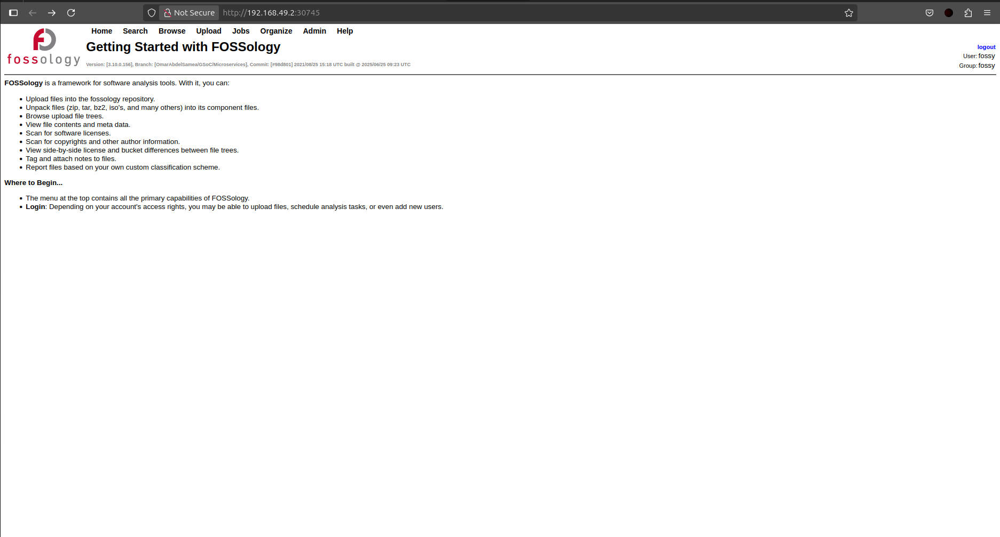

<!--
SPDX-License-Identifier: CC-BY-SA-4.0

SPDX-FileCopyright Text: 2025 Muhammad Salman <chsalmanramzan422@gmail.com>
-->

# Week 3

*(June 17, 2025 - June 23, 2025)*

## Challenges I Faced

**Database Connection Trouble:** The web pod was starting before the database is ready, showing "Could not connect to FOSSology database.

**Reboot Glitch:** After a reboot, the UI sometimes reverted to the default Debian Apache screen.

**Image Pull Issues:** Kubernetes couldn’t grab the <code>fossology/scheduler:3.11.0 </code> image from Docker Hub, causing <code>ImagePullBackOff</code> errors.

**Fixed Scheduler Build Error:** I ran into a <code>no curl.h file</code> error while building the scheduler. I added <code>libcurl4-openssl-dev</code> to **Dockerfile** and **Dockerfile.pkg** to fix it, so the scheduler could build properly.

**Scheduler Pod Keeps Crashing:** The **scheduler** pod wass stucked in a <code>CrashLoopBackOff</code> loop because of a PostgreSQL error: <code>tables can have at most 1600 columns</code> when adding a new column to the license_candidate table. This happens during database updates and makes the pod crash every time it restarts.

## What I Got Done

**Checked Database Connection:** I made sure the database was working:

- Ran <code>kubectl get svc</code> to see the database service on port <code>5432:30543/TCP</code>.

- Used a debug pod with <code>kubectl run -it --rm debug-pod --image=postgres --restart=Never -- bash</code> and connected with <code>psql -h db -U fossy -d fossology</code> to confirm the database was up.

- Tested with <code>kubectl port-forward svc/db 5432:5432</code> and checked web pod settings with <code>kubectl exec -it web-pod -- env | grep -i db</code>. Everything checked out locally!

**Debugged Kubernetes Pods:** I dug into the scheduler issues with:

- <code>kubectl get pods</code> to spot <code>CrashLoopBackOff</code> and <code>ImagePullBackOff</code>.

- <code>kubectl logs scheduler-cf985bd75-tbf22</code> to check the error details.

- <code>kubectl rollout restart deployment scheduler</code> and <code>kubectl delete pod scheduler-cf985bd75-tbf22</code> to restart the pod.

- Built a custom scheduler Dockerfile and loaded it into Minikube to work around the image pull issue, though it’s a temporary fix.

**Fixed Web Pod Startup:** To stop the web pod from starting too early, I updated <code>k8s/20-web-deployment.yaml</code> with a <code>wait-for-db</code> section using BusyBox. It checks if the database is ready with <code>nc -z $(FOSSOLOGY_DB_HOST) 5432</code>. 

After running <code>kubectl apply -f k8s/20-web-deployment.yaml</code>, the logs showed **“Fossology initialisation complete; Starting up...”**.

**Cleared Database Issues:** To fix the PostgreSQL column error, I reset the database by running <code>kubectl delete pod db-0, kubectl delete pvc database</code>, and <code>kubectl apply -f k8s/</code> to start fresh.

**Got the FOSSology UI Working:** I built the web pod with <code>docker build -t fossology/web:3.11.0-fixed .</code> and the FOSSology UI popped up at http://192.168.49.2:30745. Below are the ss of FOSSology UI.

## Meeting 1

*(June 18, 2025)*

I was supposed to meet with my mentor [Avinal](https://github.com/avinal), but he was out of the country and couldn’t make it. I shared a Google Docs link with my progress to keep him updated and we planned to catch up around June 22.

## Meeting 2 ##

*(June 19, 2025)*

I shared all my progress with the FOSSology team in community meeting, from getting the database connection working and the scheduler’s <code>ImagePullBackOff</code> error and building my own Dockerfile for temporary testing. I also talked about the web pod starting too early and the <code>CrashLoopBackOff</code> issue. The mentors suggested trying **Helm Charts** to make deployments easier.

## Meeting 3 ##

*(June 23, 2025)*

I had an awesome call with my mentor [Avinal](https://github.com/avinal). We went over everything: the FOSSology UI is up and running, most pods (like <code>db-0</code> and <code>web</code>) are working great, but the scheduler pod’s <code>CrashLoopBackOff</code> is messing with the upload and copyright features. We used **K9s** to check the pod logs and figure out what’s causing the crashes. Together, we cleaned up some unnecessary changes and got a better understanding of how everything connects. We didn’t fully fix the scheduler, but we end the call with a clear plan and tons of motivation!

This week gave me a deeper understanding of Microservice deployments, container orchestration and Kubernetes troubleshooting. The UI loading successfully is the big win, but the scheduler pod still needs Running status.

## Planning Next Week

For Week 4, I’m ready to dive into:

- Fix the scheduler pod’s <code>CrashLoopBackOff</code> issue and make sure the database updates work smoothly.

- Work on getting all pods up and running properly and test the overall functionality on the FOSSology UI.

- Once everything is stable, I’ll test the upload and copyright features to confirm that all parts of FOSSology are working correctly.

- I also plan to clean up and finalize all proposed changes in the code.

- After resolving any conflicts and verifying the changes, I will commit and push the updates to get feedback from my mentors.

