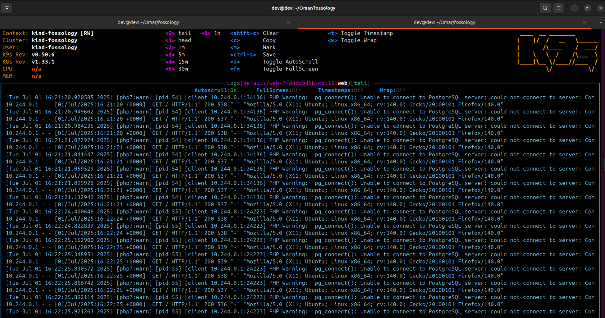

<!--
SPDX-License-Identifier: CC-BY-SA-4.0

SPDX-FileCopyright Text: 2025 Muhammad Salman <chsalmanramzan422@gmail.com>
-->

# Week 5

*(July 01, 2025 - July 07, 2025)*

## My progress this week:

This week I fixed the scheduler pod’s <code>CrashLoopBackOff</code> issue-a huge win! All the pods are now running smoothly, and I sent a commit with changes to my forked repo for my mentors to review. The FOSSology UI is still shining, but a new challenge popped up with the web pod not connecting to the database. I’m diving in to fix it and keep the momentum going.

### Scheduler pod fix:

One of the main highlights of this week was finally resolving the <code>CrashLoopBackOff</code> error that had been affecting the scheduler pod.

After extensive debugging, environment setup refinements and verification, the scheduler pod is now running as expected. This is a critical step toward making the system functional and bringing the backend services to life.

### New Changes for Review: 
I made a bunch of updates to get the pods running and pushed them to my forked repo on the **OmarAbdelSamea/GSoC/Microservices** branch and sent it to my mentors for feedback. Here is the commit:

https://github.com/SalmanDeveloperz/fossology/commit/440f9077c7fdaafec82b3647e8759a683cb38a16

### Web Pod Connectivity Issue:

Following our recent call, my mentor and I began analyzing a new issue where the web pod fails to connect to the PostgreSQL database. While other services are running fine, this problem is currently blocking the frontend from interacting with backend services.

## Meeting 1:

*(July 02, 2025)*

In our weekly call we focused on the new web pod issue, where all the pods are up and running, even scheduler pod is also in running status but the UI shows “Could not connect to FOSSology database.” due to issue in web pod. We dug into the to check the web pod’s settings. The problem seems to be that the web pod is trying to connect to PostgreSQL on localhost instead of the right database service. [Avinal](https://github.com/avinal) suggested some changes and checking the Kubernetes service setup. I’m working on these fixes and waiting for his next suggestions to get it sorted!

## Meeting 2:

*(July 03, 2025)*

In community meeting I shared my progress with community and talked about the new web pod issue and about my lastest commit.

## What’s Next for Week 6:

- Fix the web pod’s database connection so the FOSSology UI, including upload and copyright features, works perfectly.

- Keep all pods in the Kind cluster running smoothly and test them thoroughly.

- Got feedback from mentor about the previous commits and progress and made chnages if any required.

- Switching from Make to CMake after dicussion with my mentors
