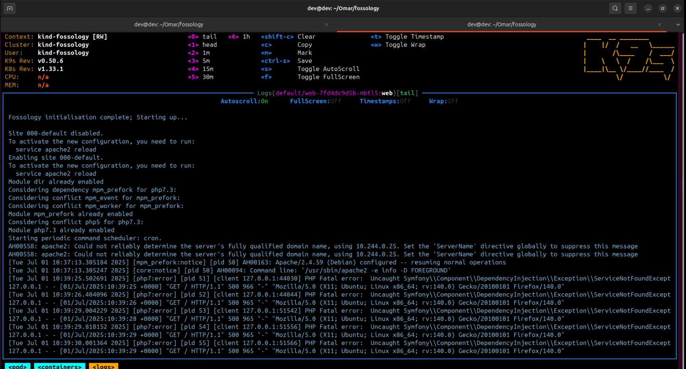

<!--
SPDX-License-Identifier: CC-BY-SA-4.0

SPDX-FileCopyright Text: 2025 Muhammad Salman <chsalmanramzan422@gmail.com>
-->

# Week 10

*(August 05, 2025 – August 11, 2025)*

## Scheduler Agent:

Most of my time went into working on the Scheduler pod. Previously, the Scheduler was a major blocker since many dependent agents rely on it to start properly. After multiple rounds of testing, debugging logs, and updating configurations and made some changes in `docker-entrypoint.k8s.sh` and in `php-conf-fix.sh` for connectivity, I was able to get the Scheduler pod running, not fully stable yet, but partially functional.

Even though it’s not fully resolved, but this is still an important step forward with Brute-force Approach.

## Working on Web Pod:

The web Pod was also not running fully due to Scheduler pod, and that's the reason of not working UI part of Infrastructure. It was showing Php Fatal error and some other connectivity issue.

## Kustomization Setup:

Alongside Scheduler, I continued refining the Kustomization setup as per the recommendation of my Mentor [Avinal](https://github.com/avinal). This is important because it helps us manage multiple **YAML**s in a more scalable way. Right now, I’m making sure everything integrates cleanly with the rest of the deployment process.

## Dockerfiles Update:

We also discussed revisiting the Dockerfiles. The current setup partially works, but it’s a bit heavy and harder to maintain. The plan is to simplify them, reduce redundancy and make it easier to extend in the future. This work is still ongoing, but once completed, it should significantly improve our workflow.

## Collaboration:

I also reached out to [Omar](https://github.com/OmarAbdelSamea) this week after discussion with [Avinal](https://github.com/avinal), as we want to clarify some important things that [Omar](https://github.com/OmarAbdelSamea) did back at time of **GSoC 2021**. I’m still waiting on his response, but I’m hoping we can sync up soon to discuss a few blockers and align on next steps.

## Meeting 1:

*(August 06, 2025)*

### Attendees:

- [Avinal](https://github.com/avinal)
- [Shaheem Azmal M MD](https://github.com/shaheemazmalmmd)
- [Muhammad Salman](https://github.com/SalmanDeveloperz)

In meeting we troubleshoot scheduler, try to make it run. [Avinal](https://github.com/avinal) also tried to set it up on his end, also I shared my partially working **Dockerfile.scheduler** , **Scheduler-deployment.yaml**  and **fossology.conf** files with [Avinal](https://github.com/avinal) to ensure that running on his end fine.
We also explore and understand how the whole Infrastructure of Scheduler is working, what are the major things required to make it run and the agents that are dependent on scheduler.

## Meeting 2:

*(August 07, 2025)*

In weekly community meeting, I shared the following progress:

- I worked on Kustomization this week.

- Most of my focus was on the Scheduler agent. I managed to get the Scheduler pod running, but it’s still not fully functional yet.

- We discussed that the Dockerfiles will be redone to make the setup simpler and more maintainable. This work is currently ongoing.

- I also mentioned that I had reached out to [Omar](https://github.com/OmarAbdelSamea) for more clarity and guidance, and I’m waiting for his response.