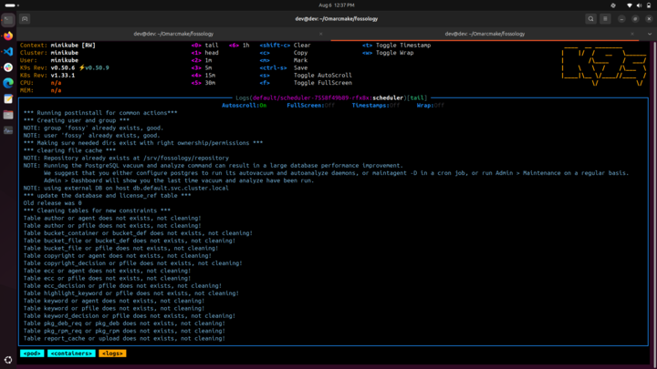
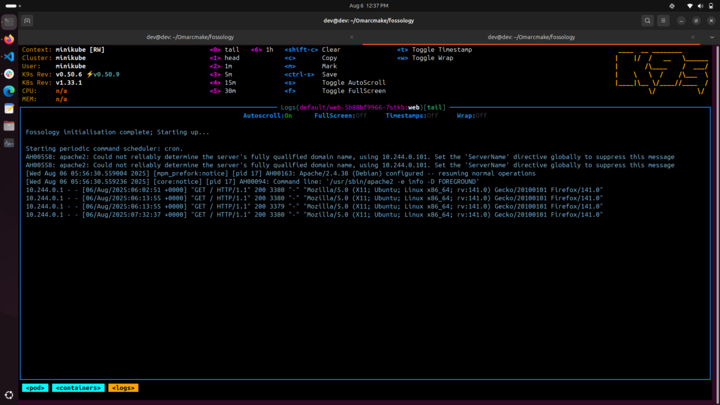

<!--
SPDX-License-Identifier: CC-BY-SA-4.0

SPDX-FileCopyright Text: 2025 Muhammad Salman <chsalmanramzan422@gmail.com>
-->

# Week 11

*(August 12, 2025 – August 18, 2025)*

## Scheduler Agent Work

This week, most of time was again focused on the **Scheduler pod**, as it is the core component that controls the execution of other agents. Without the scheduler running properly, dependent agents like **Ojo** and **Nomos**, **Web** etc... cannot start.  

I continued **testing**, **reviewing logs** and **updating configurations** (such as changes in **`docker-entrypoint.k8s.sh`** and **`php-conf-fix.sh`**) to push the scheduler closer to a stable state.  

Currently, the scheduler is **more than partially working** and it’s a step forward compared to previous weeks. And I was able to confirm some progress on the **Web pod** as well. Getting the UI locally is still in progress, but the debugging effort is paying off.

Here is the progress of both Scheduler and web Agents:

  
  

This remains the **main blocker** in our microservices deployment, and once it is stable, the dependent agents should also run smoothly.

## Kustomization Setup

Alongside the scheduler debugging, I spent time **learning and working on Kustomization** as per suggestion of [Avinal](https://github.com/avinal). The goal here is to properly manage multiple **Kubernetes YAMLs** in a scalable way.  

I’ve been going through examples of **base and overlay (dev/prod)** structures and planning how to fit them into our current **`k8s/`** directory. This work is ongoing and I continue to refine the setup in the coming week. Here's the structure I've built:

```bash
k8s/
├── base/
│   ├── 00-configmap.yaml
│   ├── 01-db-secret.yaml
│   ├── 02-db-service.yaml
│   ├── 03-database-persistentvolumeclaim.yaml
│   ├── 04-db-statefulset.yaml
│   ├── 05-etcd-service.yaml
│   ├── 06-etcd-persistentvolumeclaim.yaml
│   ├── 07-etcd-deployment.yaml
│   ├── 08-scheduler-service.yaml
│   ├── 09-service-account-scheduler.yaml
│   ├── 10-repository-persistentvolumeclaim.yaml
│   ├── 11-scheduler-deployment.yaml
│   ├── 12-agent-service.yaml
│   ├── 13-adj2nest-deployment.yaml
│   ├── 14-ununpack-deployment.yaml
│   ├── 15-wgetagent-deployment.yaml
│   ├── 16-copyright-deployment.yaml
│   ├── 17-nomos-deployment.yaml
│   ├── 18-ojo-deployment.yaml
│   ├── 19-web-service.yaml
│   ├── 20-web-deployment.yaml
│   ├── 21-monk-deployment.yaml
│   ├── 22-scanoss-deployment.yaml
│   ├── 23-delagent-deployment.yaml
│   ├── 24-cyclonedx-deployment.yaml
│   ├── 25-readmeoss-deployment.yaml
│   ├── configmap.yaml.example
│   ├── db-secret.yaml.example
│   ├── fo_delete.sh
│   └── kustomization.yaml
├── overlays/
│   ├── dev/
│   │   ├── patch-scheduler-deployment.yaml
│   │   ├── patch-db-secret.yaml
│   │   └── kustomization.yaml
│   ├── prod/
│   │   ├── patch-scheduler-deployment.yaml
│   │   ├── patch-db-secret.yaml
│   │   └── kustomization.yaml
```

## Dockerfiles Simplification

Another point I discussed with mentors was the need to redo the Dockerfiles. The current Dockerfiles work, but they are heavy and harder to maintain. A simpler configuration will not only make builds faster but also reduce complexity for future development. This task is still in progress and I will keep iterating on it.

## Collaboration and Mentorship

- I have been actively collaborating with [Avinal](https://github.com/avinal) on scheduler debugging. We discussed different approaches, including **curl-based** communication and the possibility of shared resources for agents, but for now, we are focusing on **getting the current setup running first** before moving to optimal solutions.  
- I also reached out to [Omar](https://github.com/OmarAbdelSamea) (who worked on FOSSology microservices in **GSoC 2021**) for clarifications. I’m still awaiting his response, but his insights will be important to unblock some parts of this work.  

## Meeting 1

*(August 13, 2025)*  

### Attendees:

- [Avinal](https://github.com/avinal)
- [Shaheem Azmal M MD](https://github.com/shaheemazmalmmd)
- [Muhammad Salman](https://github.com/SalmanDeveloperz)

In the mentor call this week, I shared updates on:  

- Partial progress with the **Scheduler pod**  
- Debugging work done on `docker-entrypoint.k8s.sh` and `php-conf-fix.sh`  
- Early testing of the **Web pod** with scheduler integration  
- Plan to simplify Dockerfiles  

The discussion confirmed that for now we should continue with the **curl-based scheduler approach**, and later explore the optimal solution once things are stable.  

## Meeting 2

*(August 14, 2025)*  

In the weekly community meeting call, I summarized my progress:  

- Spent most of the week debugging the **Scheduler pod**, and got it partially running  
- Worked on the **Web pod**, which now shows partial connectivity with the scheduler  
- Continued learning **Kustomization** for Kubernetes deployments  
- Mentioned the plan to redo Dockerfiles for cleaner configuration  
