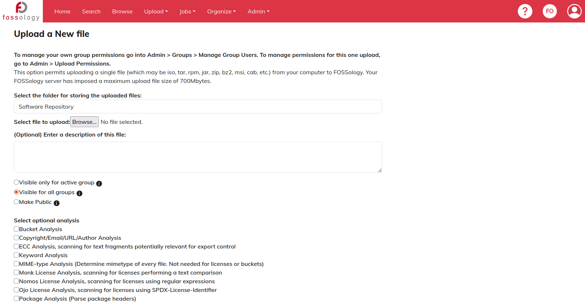
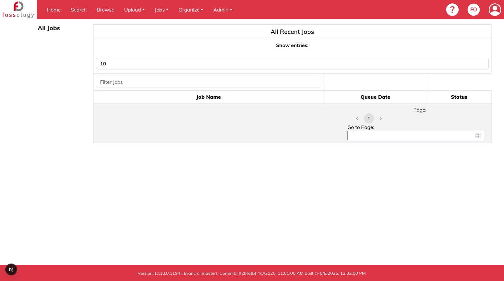

<!--
SPDX-License-Identifier: CC-BY-SA-4.0

SPDX-FileCopyrightText: 2025 Tiyasa Kundu <tiyasakundu20@gmail.com>
-->

# Week 6 Meetings and Activities

## FOSSology GSoC Weekly Meet

*(July 10, 2025)*

### Attendees:

- [Shaheem Azmal M MD](https://github.com/shaheemazmalmmd)
- [Kaushlendra Pratap](https://github.com/Kaushl2208)
- [Ayush Bhardwaj](https://github.com/hastagAB)
- [Anupam Ghosh](https://github.com/ag4ums)
- [Sushant Kumar Mishra](https://github.com/its-sushant)
- [Jan Altenberg](https://github.com/JanAltenberg)
- [Dearsh Oberoi](https://github.com/deo002)
- [Amrit Kumar Verma](https://github.com/amritkv)
- [Muhammad Salman](https://github.com/SalmanDeveloperz)
- [Tiyasa Kundu](https://github.com/tiyasakundu)
- [Vaibhav Sahu](https://github.com/Vaibhavsahu2810)
- [Chayan Das](https://github.com/ChayanDass)
- [Ahmed Gamal](https://github.com/Ahmed-Gamal24)
- [Oyewale Abdulsobur](https://github.com/smilingprogrammer)
- [Devanshi Sachan](https://github.com/devxnshi)

### Missed:
- [Katharina Ettinger](https://github.com/EttingerK)
- [Gaurav Mishra](https://github.com/GMishx)
- [Sahil Jha](https://github.com/sjha2048)
- [Avinal Kumar](https://github.com/avinal)
- [Rajul Jha](https://github.com/rajuljha)
- [Soham Banerjee](https://github.com/soham4abc)
- [Harshit Gandhi](https://github.com/harshitg927)
- [Prakash-Mishra](https://github.com/Prakash-Mishra-9ghz)

### Discussion

#### Mentors

- [Shaheem Azmal M MD](https://github.com/shaheemazmalmmd)
    - General updates regarding the project. 
    - Request contributors to finish their evaluation without fail.

#### Contributors

- [Tiyasa Kundu](https://github.com/tiyasakundu)
    - Shared Week 6 progress with the community, highlighting ongoing work on the React to Next.js migration task.
    - Showcased successful migration of the remaining pages under Upload, Jobs.

- Other Contributors
    - Each contributor briefly shared their weekly progress and updates.

## Activities Done in Week 6

- Successfully migrated and rendered the remaining pages under Upload and Jobs in the new Next.js setup.
- Discussed the upcoming UI design handoff and was advised to evaluate the development effort once access to the design file is granted.
- Commited the code of all the migration task done until now in the following commit:
  - [Commit: becc82b](https://github.com/fossology/FOSSologyUI/pull/315/commits/becc82b57f0d3f6dd43edafec0431f9bbd71d1a3)

### Progress Demo

- Upload a new file page under Upload menu after migrating from React 17 to Next 15 app:

- All Jobs page under Jobs menu after migrating from React 17 to Next 15 app:

## Next Steps

- Continue migrating remaining pages and components to the Next.js setup.
- Evaluate the development effort once access to the figma design file is granted.