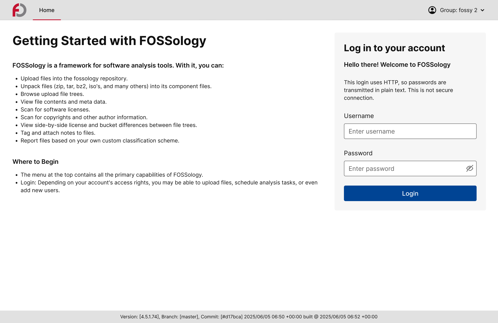

<!--
SPDX-License-Identifier: CC-BY-SA-4.0

SPDX-FileCopyrightText: 2025 Tiyasa Kundu <tiyasakundu20@gmail.com>
-->

# Week 10 Meetings and Activities

## Project Sync Meeting 11

*(August 5, 2025)*

### Attendees

- [Tiyasa Kundu](https://github.com/tiyasakundu)
- [Shaheem Azmal M MD](https://github.com/shaheemazmalmmd)
- [Amrit Kumar Verma](https://github.com/amritkv)
- [Gaurav Mishra](https://github.com/gmishx)
- [Kaushlendra Pratap](https://github.com/Kaushl2208)
- [Devanshi Sachan](https://github.com/devxnshi)
- [Dearsh Oberoi](https://github.com/deo002)

### Discussion

- Showed mentors the progress in the implementation of the redesigned components and pages.
- Completed implementing the redesigned Home Page, including the login form, authentication integration, and alert message handling for login success/failure.
- Completed implementing the Search Page.
- Installed and configured required shadcn components (Button, Input, Alert, Card, Form, Accordion, Radio Group) to support the redesign.

## Activities Done in Week 10

- Implemented the redesigned Home Page with login form and authentication integration and the Search Page.
- Added alert messages for both login success and failure states.
- Installed and configured required shadcn components such as Button, Input, Alert, Card, Form, Accordion, Radio Group.
- Committed the implemented Home and Search Pages source code to the open PR ([commit link](https://github.com/fossology/FOSSologyUI/pull/318/commits/b4c8a73cd2fabc763401937fd0a4d921e103d232)).
- The Pull Request [#318](https://github.com/fossology/FOSSologyUI/pull/318) got succesfully merged after code review.

### Progress Demo

- Redesigned Home Page:

- Redesigned Search Page:

## Next Steps

- Continue implementing other redesigned components and pages as per the redesigned UI mockups.