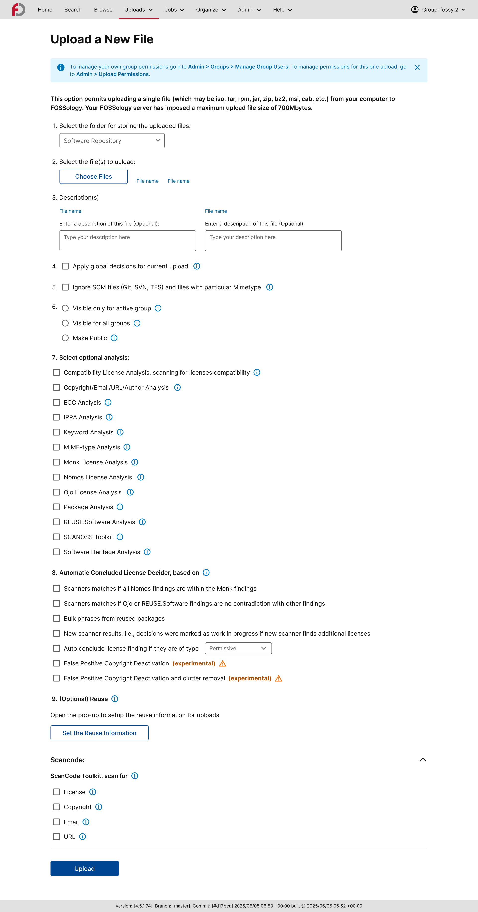

<!--
SPDX-License-Identifier: CC-BY-SA-4.0

SPDX-FileCopyrightText: 2025 Tiyasa Kundu <tiyasakundu20@gmail.com>
-->

# Week 12 Meetings and Activities

## FOSSology GSoC Weekly Meet

*(August 21, 2025)*

### Attendees:

- [Shaheem Azmal M MD](https://github.com/shaheemazmalmmd)
- [Katharina Ettinger](https://github.com/EttingerK)
- [Gaurav Mishra](https://github.com/GMishx)
- [Kaushlendra Pratap](https://github.com/Kaushl2208)
- [Ayush Bhardwaj](https://github.com/hastagAB)
- [Sushant Kumar Mishra](https://github.com/its-sushant)
- [Jan Altenberg](https://github.com/JanAltenberg)
- [Dearsh Oberoi](https://github.com/deo002)
- [Amrit Kumar Verma](https://github.com/amritkv)
- [Muhammad Salman](https://github.com/SalmanDeveloperz)
- [Tiyasa Kundu](https://github.com/tiyasakundu)
- [Vaibhav Sahu](https://github.com/Vaibhavsahu2810)
- [Chayan Das](https://github.com/ChayanDass)
- [Prakash-Mishra](https://github.com/Prakash-Mishra-9ghz)
- [Ahmed Gamal](https://github.com/Ahmed-Gamal24)
- [Oyewale Abdulsobur](https://github.com/smilingprogrammer)
- [Devanshi Sachan](https://github.com/devxnshi)
- [Avinal Kumar](https://github.com/avinal)
- [Rajul Jha](https://github.com/rajuljha)
- [Harshit Gandhi](https://github.com/harshitg927)

### Missed:

- [Sahil Jha](https://github.com/sjha2048)
- [Soham Banerjee](https://github.com/soham4abc)
- [Anupam Ghosh](https://github.com/ag4ums)

### Discussion

#### Mentors

- [Shaheem Azmal M MD](https://github.com/shaheemazmalmmd)
    - General updates regarding project.

#### Contributors

- [Tiyasa Kundu](https://github.com/tiyasakundu)
    - Shared Week 12 progress with the community, showcasing the completion of the implementation of the Upload a File Page, including the Reuse overlay.
    - Mentioned the changes made as per code review feedback on the WIP Pull Request [#328](https://github.com/fossology/FOSSologyUI/pull/328).
    - Highlighted the commit with the implemented Upload a File Page and requested changes ([commit link](https://github.com/fossology/FOSSologyUI/pull/328/commits/34e397a71330bcd5dfc84960db75d5f7ade79a3b)).

- Other Contributors
    - Each contributor briefly shared their weekly progress and updates.

## Activities Done in Week 12

- Successfully implemented the Upload a File Page in the redesigned Next.js setup.
- Added the Reuse Overlay functionality as part of the Upload workflow.
- Addressed and implemented the requested changes from code review on the WIP Pull Request [#328](https://github.com/fossology/FOSSologyUI/pull/328).
- Committed the updated code with the Upload a File Page and the requested changes ([commit link](https://github.com/fossology/FOSSologyUI/pull/328/commits/34e397a71330bcd5dfc84960db75d5f7ade79a3b)).

### Progress Demo

- Redesigned Upload a File Page:

## Next Steps

- Continue and complete implementing other redesigned components and pages as per the redesigned UI mockups.
- Complete the migration from REST API v1 to REST API v2 for all endpoints.
- Complete the implementation of the Storybook component library for reusable UI components.