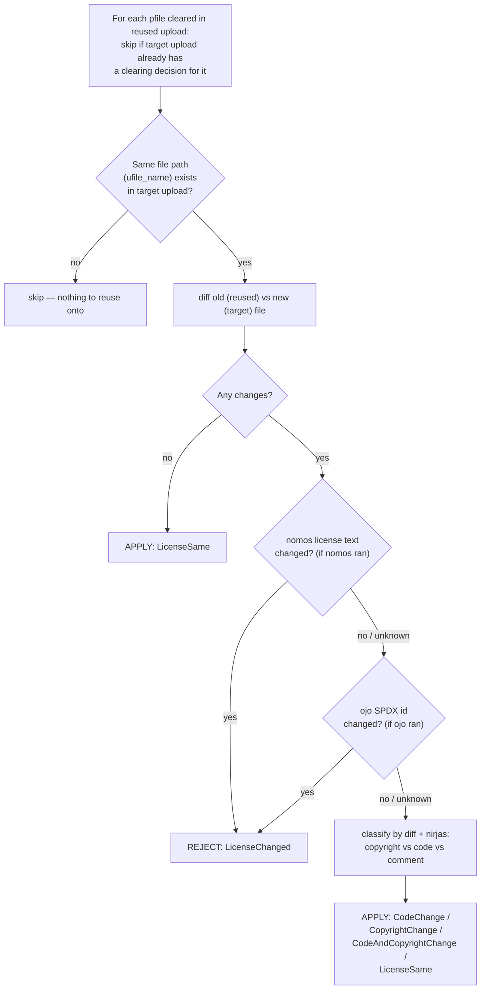

**Attendees:**

- [Saksham Mishra](https://github.com/sakshammishra112)
- [Shaheem Azmal M MD](https://github.com/shaheemazmalmmd)

**Absentees:**

- [Sushant Kumar](https://github.com/its-sushant)
- [Kaushlendra Pratap](https://github.com/Kaushl2208)

### Summary

1. Shaheem reviewed the [#3676](https://github.com/fossology/fossology/pull/3676) and suggest some changes. He also suggested to looking into using the getUploads used in the reuser configuration for auto-select feature.
2. I showed the workflow of the new agent enhancedresuer, and we discussed on how we can use the scanner agents that have already ran on the file.
3. I suggested to use nomos highlights for comparing the reuse and target package file.

