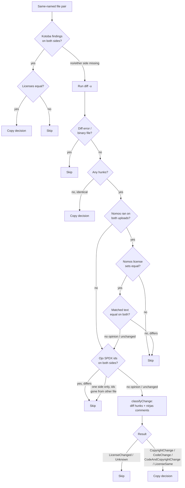

**Attendees:**

- [Saksham Mishra](https://github.com/sakshammishra112)
- [Shaheem Azmal M MD](https://github.com/shaheemazmalmmd)
- [Kaushlendra Pratap](https://github.com/Kaushl2208)

**Absentees:**

- [Sushant Kumar](https://github.com/its-sushant)

### Summary

1. I asked shaheem whether some changes in the getupoads() response be changed and doesn't affect the performance, this is for the auto select feature.
2. Discussed some changes in the architecture of the new agent enhanced reuser.
3. Had discussion on the architecture of the

